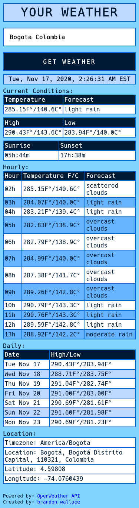
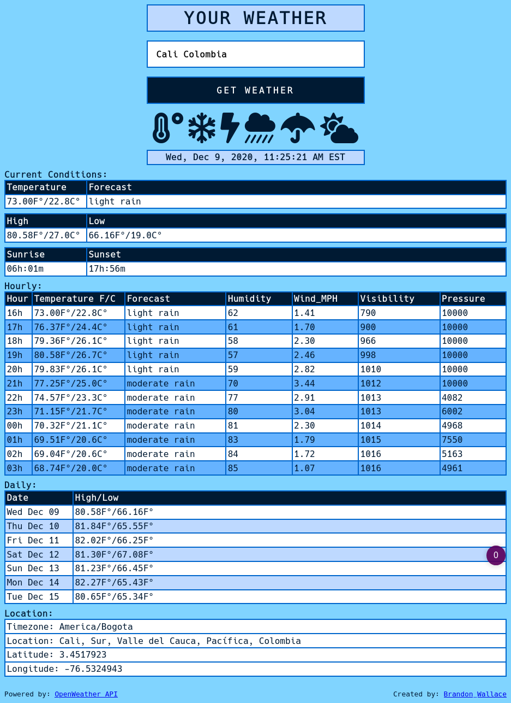

# A weather report application build with Python, Flask, and Geopy.




# Requirements
```
Python 3
Flask
Requests
Geopy
```

# Clone repository
```
$ git clone https://github.com/brandon-wallace/simpleweatherreport.git

$ cd simpleweatherreport/
```

# Create a .env file
```
$ vim .env
# Add these 4 lines.

FLASK_APP=run.py
FLASK_ENV=development
SECRET_KEY=<your_secret_key>
OWM_API_KEY=<your_api_key>
```

# Install requirements
```
$ pipenv install
```

# Start application
```
$ flask run
```

# Browse to address:

http://127.0.0.1:5000
