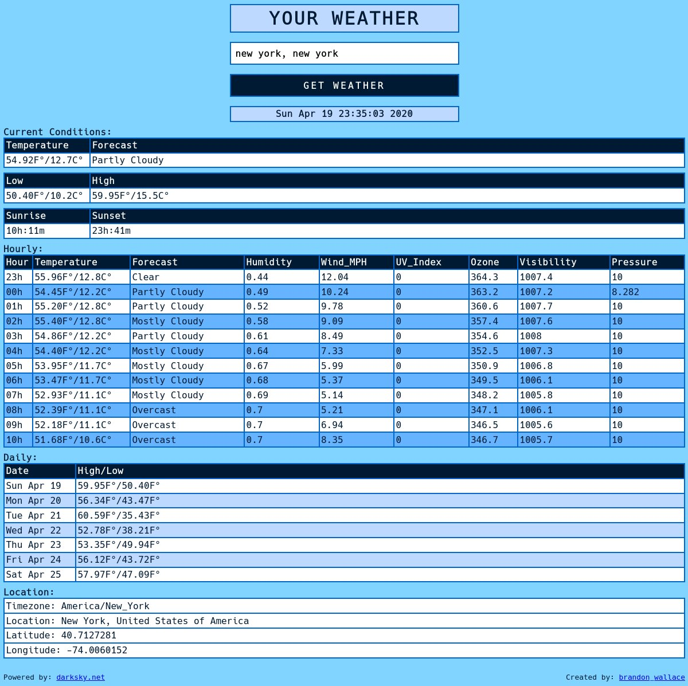

# A weather report application build with Python, Flask, and Geopy.




# Requirements
```
Python 3
Flask
Requests
Geopy
```

# Run
```
$ git clone https://github.com/brandon-wallace/simpleweatherreport.git
```

```
$ cd simpleweatherreport/
```

```
$ touch .env

$ vim .env
Add these 4 lines.

FLASK_APP=run.py
FLASK_ENV=development
SECRET_KEY=<your_secret_key>
API_KEY=<your_api_key>
```

```
$ pipenv install
```

```
$ flask run
```

# Go to 

http://127.0.0.1:5000
